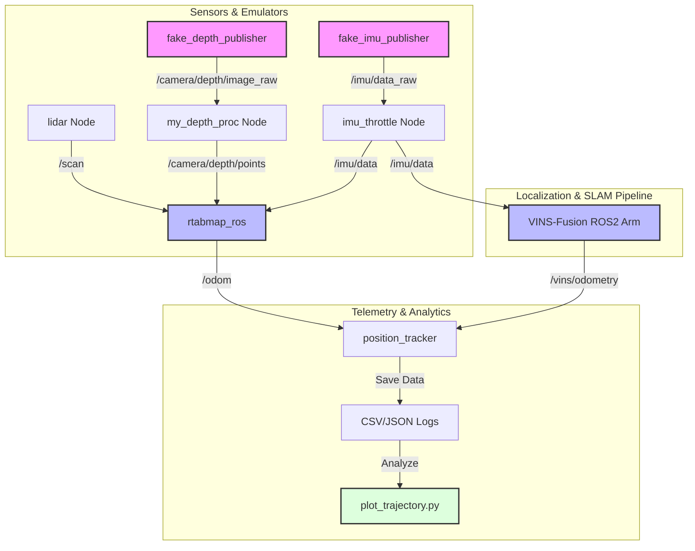

# 🌀 VIO-VSLAM: Advanced Visual-Inertial Odometry & Graph SLAM

[](https://docs.ros.org/en/humble/index.html)
[](LICENSE)
[](https://github.com/VedhSontha/VIO-VSLAM)
[](https://colcon.readthedocs.io/)

A complete, high-performance Visual SLAM (Simultaneous Localization and Mapping) and Visual-Inertial Odometry (VIO) package integrated with ROS 2 Humble. This repository features custom depth processing pipelines, RTAB-Map configurations, real-time sensor emulators, trajectory tracking utilities, and a custom ARM-optimized port of VINS-Fusion.

---

## 📸 System Architecture



---

## 🛠️ Core Components

### 1. `my_depth_proc` (ROS 2 Humble Package)
A custom C++/Python package that converts 2D depth camera streams into dense 3D pointclouds (`sensor_msgs/msg/PointCloud2`). 
* **Input Topics**: `/camera/depth/image_raw` (`sensor_msgs/msg/Image`), `/camera/depth/camera_info` (`sensor_msgs/msg/CameraInfo`)
* **Output Topics**: `/camera/depth/points` (`sensor_msgs/msg/PointCloud2`)
* **Features**: Configurable depth scale, bilateral filtering to reduce sensor noise, and multi-threaded processing.

### 2. VINS-Fusion ROS 2 ARM Port (`src/VINS-Fusion-ROS2-humble-arm`)
An optimized implementation of the optimization-based estimator VINS-Fusion, specifically built for ARM-based embedded controllers (e.g., Jetson Nano, Raspberry Pi 5).
* Supports online spatial-temporal calibration between cameras and IMU.
* Tight fusion of visual features and IMU pre-integration.
* Loop closure integration via DBoW2.

### 3. RTAB-Map SLAM Config (`src/my_rtabmap_config`)
Configurations and launch scripts to deploy **RTAB-Map** (Real-Time Appearance-Based Mapping) for 3D visual mapping and localization.
* Supports **RGB-D SLAM**, **Stereo SLAM**, and **VIO integration**.
* Implements loop-closure detection, multi-session mapping, and 2D/3D occupancy grid projection.

### 4. Real-Time Utilities & Emulators (`py scripts/`)
* **`fake_depth_publisher.py` & `fake_depth_publisher_fixed.py`**: Simulates RGB-D depth image frames for testing pipelines headlessly without physical hardware.
* **`fake_imu_publisher.py`**: Publishes mock IMU data simulating acceleration and angular velocity.
* **`imu_throttle.py`**: Rate-limits IMU sensor outputs to prevent high-frequency topics from saturating the ROS 2 message buffers.
* **`position_tracker.py` & `position_moniter.py`**: Logs the robot's real-time trajectory, speeds, and orientation coordinates into JSON and CSV files.

---

## 📊 Trajectory Plots & Performance Metrics

We analyze the accuracy of the VIO/VSLAM estimation by logging odometry data and plotting the robot paths. Below is a summary of the runs logged in this repository:

### Telemetry Summary

| Run/Log Name | Tracked Points | Duration (s) | Total Path Length (m) | Average Speed (m/s) | Max Speed (m/s) | Notes / Status |
| :--- | :---: | :---: | :---: | :---: | :---: | :--- |
| **Calibration/Idle** (`..._013126.csv`) | 1,049 | 104.80 | 0.000m | 0.000 | 0.000 | Static sensor noise test |
| **Trajectory Run 1** (`..._013935.csv`) | 1,022 | 102.10 | 4.905m | 0.054 | 0.384 | Complete loop trajectory |
| **Trajectory Run 2** (`..._223654.csv`) | 1,537 | 153.60 | 2.630m | 0.023 | 0.152 | Slow exploration test |
| **Trajectory Run 3** (`..._223747.csv`) | 975 | 97.40 | 2.623m | 0.036 | 0.151 | Medium speed traversal |

### Visualizations

The following graphs are generated automatically using the custom [plot_trajectory.py](py%20scripts/plot_trajectory.py) script. They illustrate 2D paths (Top View), position over time, yaw angles, and velocity analysis:

#### Trajectory Run 1 (Loop Trajectory)


#### Trajectory Run 2 (Slow Exploration)


#### Trajectory Run 3 (Medium Speed)


---

## 🚀 Running the Packages

### 1. Build the Workspace
Install the Ceres Solver dependency (already packaged in this repo):
```bash
cd ceres-solver-2.1.0 && mkdir build && cd build
cmake .. && make -j$(nproc) && sudo make install
```

Build the ROS 2 packages using `colcon`:
```bash
# In the root workspace folder Vslam&VIO
colcon build --symlink-install
source install/setup.bash
```

### 2. Launching VSLAM with RTAB-Map
Launch the RGB-D mapping node:
```bash
ros2 launch my_rtabmap_config rtabmap_rgbd.launch.py
```

### 3. Launching VIO Odometry
Launch the visual-inertial odometry pipeline with custom parameter overrides:
```bash
ros2 launch my_rtabmap_config rtabmap_vio.launch.py
```

### 4. Running the Trajectory Telemetry & Plotting Tools
Record active odometry topics:
```bash
python3 "py scripts/position_tracker.py"
```

To plot the recorded path and generate analytics graphs:
```bash
python3 "py scripts/plot_trajectory.py" path/to/robot_trajectory_file.csv
```
